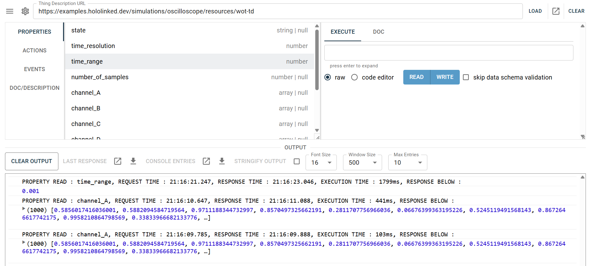
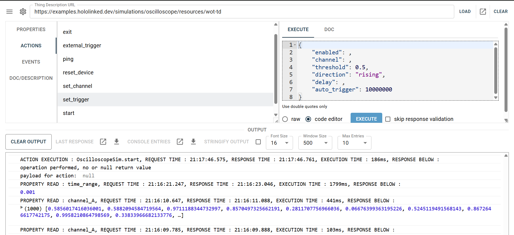
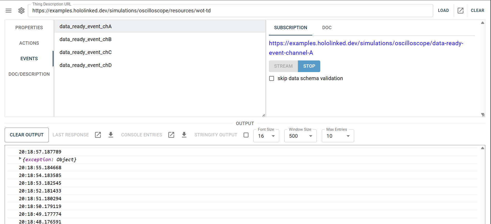
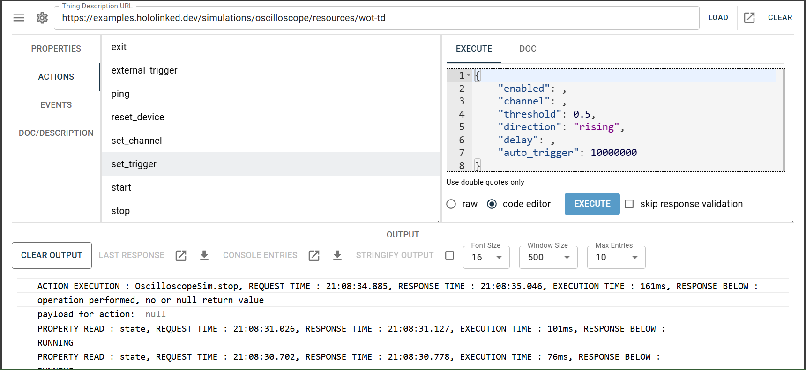
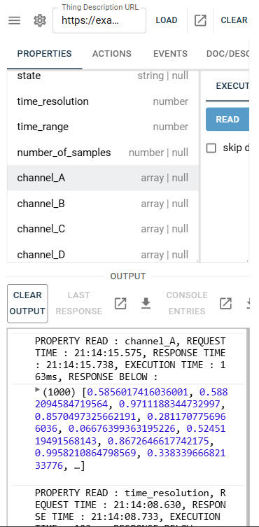
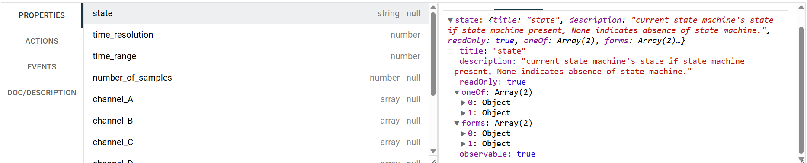

# Thing Control Panel

Admin control panel in React for Things having a standard WoT Thing Description with HTTP protocol binding or 
implemented with [`hololinked`](https://github.com/VigneshVSV/hololinked). Suitable for development of server backend, 
test properties, actions and events or generic use purposes to interact with the Thing. 

Based on Eclipse Thingweb.  

The GUI is only coming up, its still rough on the edges. If anything is not upto your standard or buggy/broken,
 please do feel free to reach me, open a discussion in the discussions tab or an issue, or contribute to an existing issue. 
<br>
[](mailto:vignesh.vaidyanathan@hololinked.dev) [](https://hololinked.dev/contact) <br>

[Visit Here](https://control-panel.hololinked.dev) for predeployed website with SSL. <br>
[Visit Here](http://no-ssl-control-panel.hololinked.net) for predeployed website without SSL. <br> <br>
Based on your server SSL support, you can choose the appropriate link.


 <br>


### Installation

If you intend to self host or use as a desktop app:

```npm install . ``` or ```npm install . --force``` to install the requirements and dependencies <br/>
```npm run dev``` to run as react app <br/>
```npm run dev -- --host --port 12345``` to run on the network <br/>
```npm run build``` to build and host with your own HTTP server <br/>

This application is written in plain React and therefore CSR. It is intended to keep it like that.

### Examples

| Device | **SSL** | **Non-SSL** |
|--------|---------|-------------|
| Oscilloscope Simulator | [Link](https://control-panel.hololinked.dev/#https://examples.hololinked.dev/simulations/oscilloscope/resources/wot-td) | [Link](http://no-ssl-control-panel.hololinked.net/#http://examples.hololinked.net/simulations/spectrometer/resources/wot-td) |
| Data Schema Thing | [Link](https://control-panel.hololinked.dev/#https://external-examples.hololinked.dev/data-schema-thing) | [Link](http://no-ssl-control-panel.hololinked.net/#http://external-examples.hololinked.net/data-schema-thing) |
| Advanced Coffee Machine | [Link](https://control-panel.hololinked.dev/https://external-examples.hololinked.dev/advanced-coffee-machine) | [Link](http://no-ssl-control-panel.hololinked.net/#http://external-examples.hololinked.net/advanced-coffee-machine) |
| Spectrometer Simulator | [Link](https://control-panel.hololinked.dev/https://examples.hololinked.dev/simulations/spectrometer/resources/wot-td) | [Link](http://no-ssl-control-panel.hololinked.net/#http://examples.hololinked.net/simulations/spectrometer/resources/wot-td) |

### Usage

Insert the address of the device or the endpoint of the thing description, then press load. If you are using your own Thing server runtime or a standard location to store
your thing descriptions, click on settings (cog-wheel on top left) and edit "default endpoint for fetching thing description" to suit
your requirements. The address entered in the address bar will then be considered as base URL and the default endpoint will be appended.

If you are using `hololinked` as the server, the default endpoint can be one of `/resources/wot-td` or `/resources/wot-td?ignore_errors=true`, and you can enter the Thing address as `http(s)://{address of host}/{instance name of the thing}`.

If self signed HTTP(s) certificate is used, you might have to give permission to the browser. You can open the endpoint in new tab using the new tab button on top right. 
This should fetch the thing description without fail. Sometimes, the permission given for self signed certificate given may not match the form (TD form field) entries, so please do make sure you can atleast fetch/read one property from a browser tab if the GUI is still not working.  

If you are using one of the pre-hosted websites, make sure your server sets a CORS header as the domain will not match and cross domain resource sharing needs to be enabled. There are currently no cookies and credentials moving around in the website, so its completely safe. 

After you load, your defined properties, actions and events are shown. You can freely interact with them as shown below:





Supported ops are
- read, write & observe property
- invoke action
- subscribe & unsubscribe event 
  
Whenever an operation is executed, the output is printed in the console below. 
Its recommended to install a JSON viewer for your web browser, like [this](https://chromewebstore.google.com/detail/json-viewer/gbmdgpbipfallnflgajpaliibnhdgobh).

Credentials or security definitions are not supported yet, sorry, please feel free to add support for it. The client is built on top of node-wot so all
node-wot features can, in principle, be supported. 

You can then load the console entries in a new tab and read it in a correctly formatted way or download it for other purposes. 
Edit the number of entries that can stored in the console output by setting the value of "Max Entries" from the drop down. 
More entries will take more RAM, but useful for capturing events or eventful measurement data directly in the GUI. 

### Configuration - app.config.ts

This file contains certain configurations that can be modified according to your requirements:

- `useSSL` - when set to `true`, the app will rendered with a self signed SSL certificate from vite, and the clients will be forced to use SSL. 

### Some More Images

<p float="left">
    
    
</p>



### Contributing

Contributors welcome. 

A Scrum workflow is followed for development. You can take a issue, we will assign a timeline/sprint and review it once the sprint is over. Of course, as an individual contributor there is no need to follow this or understand what is SCRUM etc. as its all free work, but it will help us to keep track of the issues and features.

[Project Planning](https://github.com/orgs/hololinked-dev/projects/7)

Meeting date: first wednesday every month, started in April 2025, see details [in organization info](https://github.com/hololinked-dev/#monthly-meetings). 

Feel free to also propose new ideas or add more WoT ops. There are also similar projects available from Web of Things community. 
